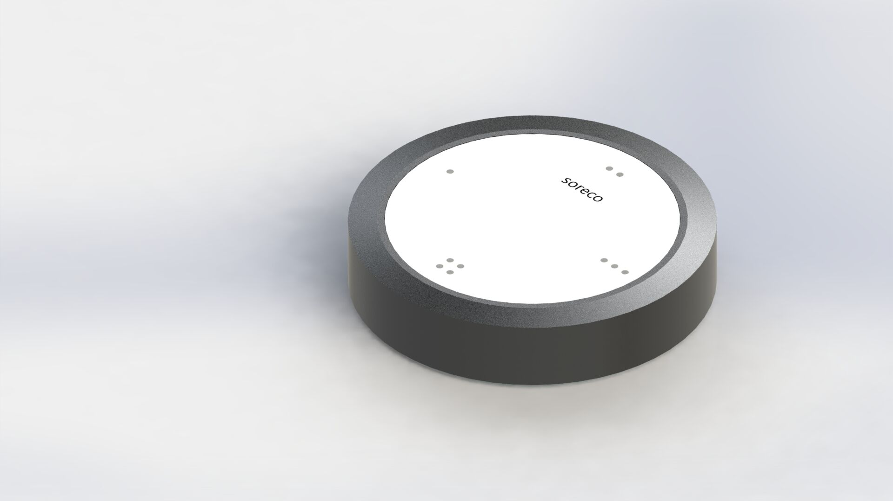

# soreco-firmware
Firmware for soreco Sonos Remote Control.

soreco is an open source hardware platform to build a remote controller for Sonos wireless home sound system.
The system is currently under development.

 

## Usage
Open soreco-firmware.ino in Arduino and flash the NodeMCU 1.0 (or any other ESP-12E Module).
Note: Requires ESP8266 board package version 2.4.0-rc2.
https://github.com/esp8266/Arduino#installing-with-boards-manager

The debug console is currently the only way to interact with the device. There are the following commands available to interact with the device:
* help (list all available commands)
* Config.Save (save configuration to persistent storage)
* Config.ClearAll (clear the persistent storage and initialize all values with 0)
* Config.FactoryDefaults (reset all configuration (except DeviceParameters) to factory defaults)
* Config.SerialNumber (get / set the serial number)
* Config.DeviceName (get / set the device name)
* Config.Sonos.Zone (get / set the sonos zone)
* Config.WiFi.SSID (get / set the WiFi SSID to connect to)
* Config.WiFi.Passphrase (get / set the WiFi passphrase for SSID)
* WiFi.Scan (scan and report all available WiFi networks)
* WiFi.Connect (connect to the configured WiFi network)
* WiFi.StartHotspot (start a WiFi hotspot "soreco-xyz", where xyz is the device serial number)
* WiFi.Status (print the WiFi status)
* Sonos.Discover (scan and report all available Sonos devices)
* Sonos.Connect (set Sonos device to control from debug console)
* Sonos.PlayState (get / set the play state ('play' | 'pause') of the Sonos device)
* Power.Mode (set the power mode ('modem' | 'light' | 'off') of ESP8266)

## Component Overview

## System behavior

## Task List
[Link to the Trello](https://trello.com/b/eYdj9IFY/firmware)

## Special Thanks
Special Thanks to [Valentin](https://github.com/vmichalak) for his work on the [sonos-controller](https://github.com/vmichalak/sonos-controller) Android library, which served as a basis for the Arduino implementation.
